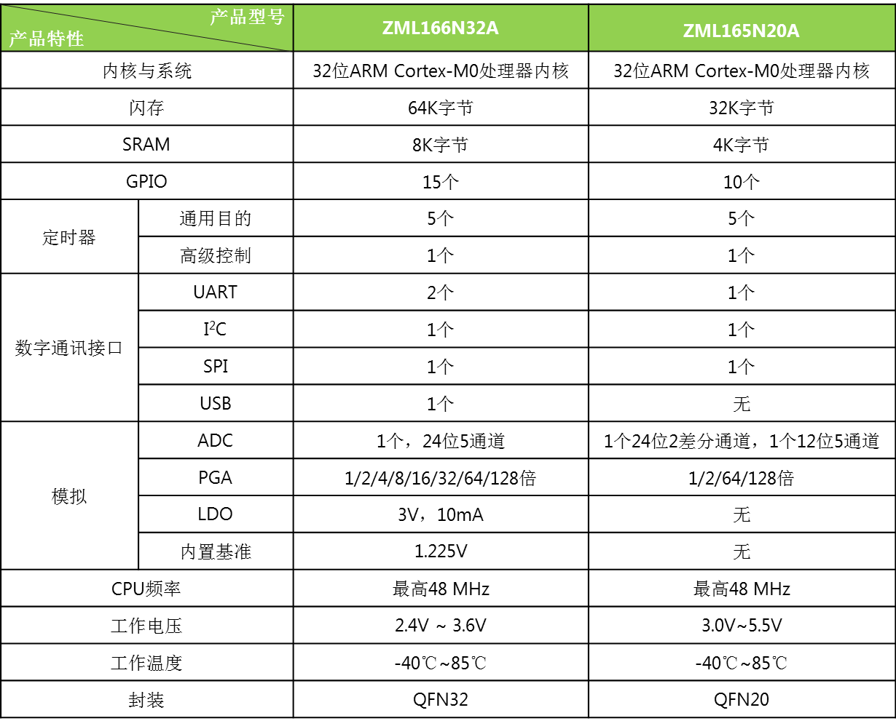

# [ZML166](https://github.com/SoCXin/ZML166)

#### [Vendor](https://github.com/SoCXin/Vendor)：[ZLG](https://www.zlgmcu.com)
#### [Core](https://github.com/SoCXin/Cortex)：[Cortex M0](https://github.com/SoCXin/CM0)
#### [Level](https://github.com/SoCXin/Level)：48 MHz  * 0.95 DMIPS/MHz

[ZML166](https://github.com/SoCXin/ZML166) 通过SIP封装集成5通道 24bit ADC

#### 核心功能

* 24 bit Σ-∆ ADC
* USB

### [选型建议](https://github.com/SoCXin)

[ZML166](https://github.com/SoCXin/ZML166) 和[ZML165](https://github.com/SoCXin/ZML165)相比，拥有全面的功能

###  [SoC芯平台](http://www.SoC.Xin)
